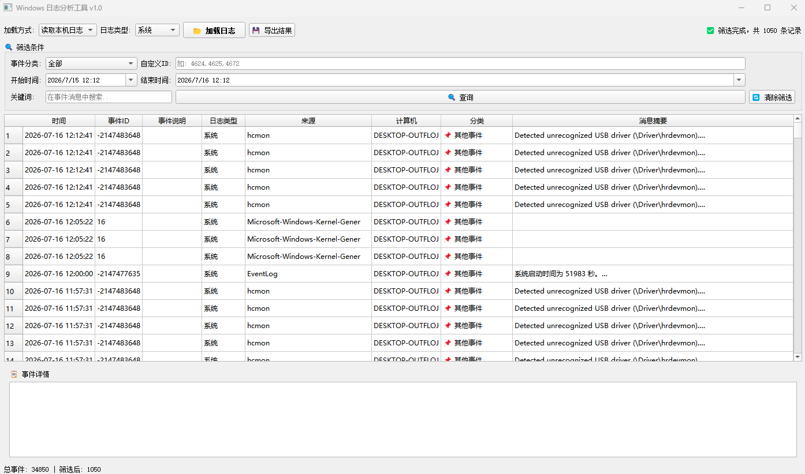
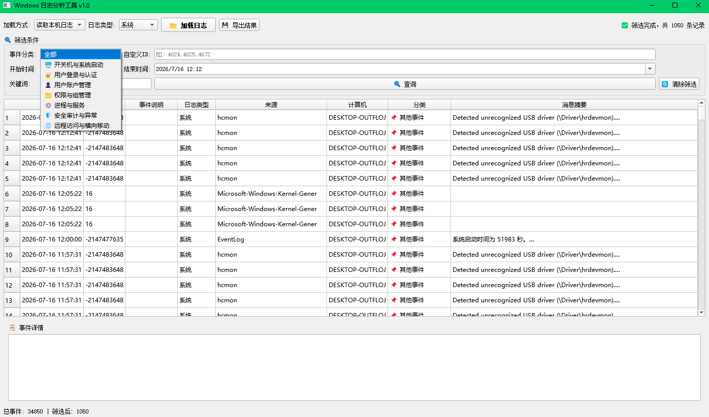

# 🪟 Windows 日志分析工具 (Win-Log)

> ⚠️ **声明**：此项目由 AI 辅助生成，旨在提供便捷、轻量的 Windows 日志解析方案。

一款专为安全分析与运维排查设计的 Windows 事件日志解析工具。支持本机实时读取与离线 `.evtx` 文件分析，帮助快速定位异常行为与案发时间点。

## ✨ 核心特性

- **双源加载**：支持读取本机日志（System / Security / Application）及导入外部 `.evtx` 文件。
- **时间轴查询**：自定义时间范围精准检索，快速锁定目标时间段。
- **深度行为分析**：自动提取登录类型（远程桌面/网络/交互等）、源 IP、账户名等关键字段。
- **上下文关联**：展示进程创建（4688）、服务安装（4697）等事件的命令行参数及父子进程关系。
- **智能组合筛选**：支持按事件分类、自定义 ID、关键词、登录类型、源 IP 进行多维度过滤。
- **一键导出**：筛选结果支持导出为 JSON 格式，便于报告编写与证据归档。

## 🚀 快速开始

### 1. 环境要求

- Windows 7 / 10 / 11 / Server 2016+
- Python 3.7+

### 2. 安装依赖

```bash
pip install -r requirements.txt
### 第 2 部分（从“运行工具”到“打包 EXE”）

```markdown

### 3. 运行工具

> ⚠️ **注意**：读取安全日志需要管理员权限，请务必以管理员身份运行！

```bash
python main.py
📦 依赖项说明
依赖库	最低版本	用途
PyQt5	>= 5.15.0	图形用户界面
python-evtx	>= 0.7.4	解析离线 .evtx 文件
pywin32	>= 306	调用 Windows 事件日志 API
🛠️ 打包为独立 EXE
无需 Python 环境即可分发使用：

pip install pyinstaller
pyinstaller -F -w --uac-admin --name LogAnalyzer main.py
💡 --uac-admin 参数确保打包后的 EXE 运行时自动请求管理员权限。


### 第 3 部分（从“使用指南”到结尾）

```markdown

## 📖 使用指南

1. **加载日志**：选择日志类型（系统/安全/应用程序），点击「加载日志」（默认加载最近 24 小时）。
2. **时间查询**：在筛选面板调整起止时间，点击「查询」重新加载指定时段日志。
3. **精确筛选**：
   - **登录类型**：选择 `10-远程桌面` 可快速定位 RDP 登录记录。
   - **源 IP**：输入可疑 IP 地址进行定向过滤。
   - **事件分类**：按「开关机」「用户登录」等预设分组筛选。
4. **查看详情**：点击表格任意行，右侧详情区将展示完整事件消息及提取的关键字段（登录类型、源 IP、命令行等）。

## 📸 界面预览




